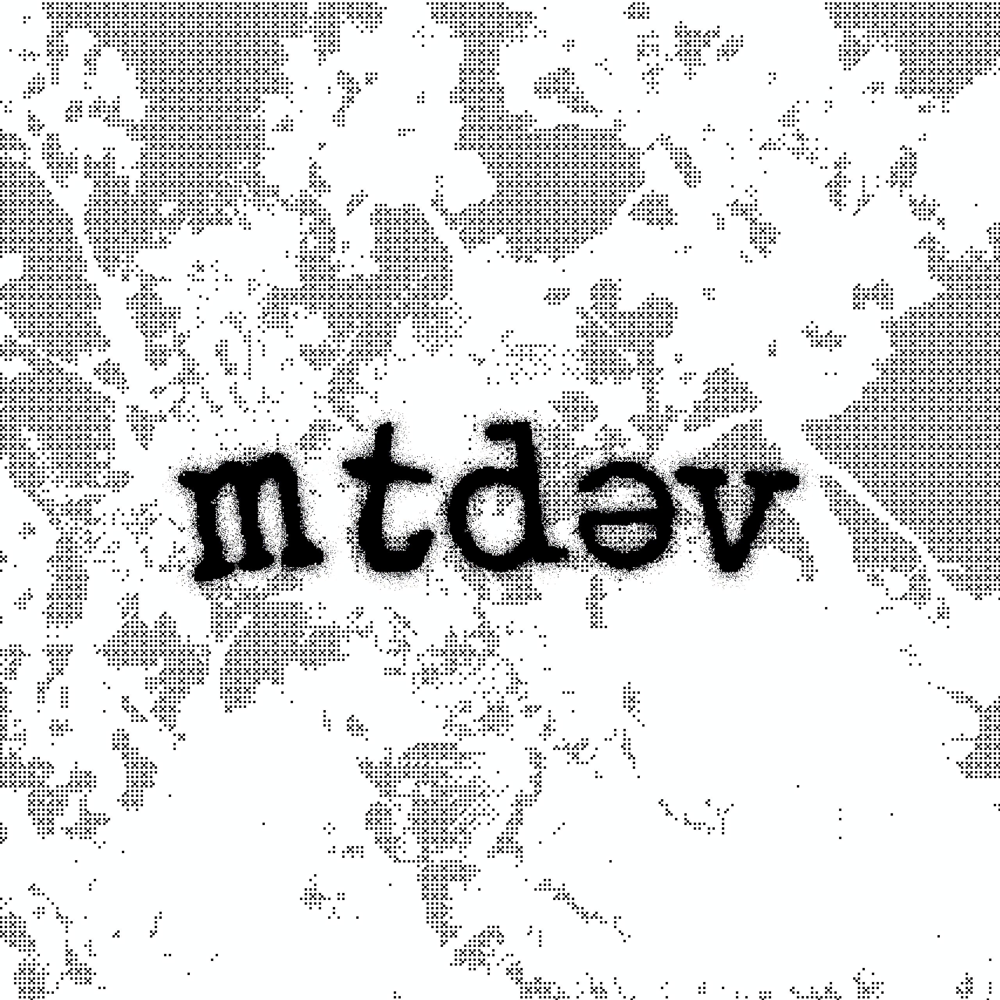

  

Personal portfolio site showcasing my projects and skills as a software developer.

  
  

## Stack
- React 19, TypeScript, and Vite
- GSAP for scroll and interaction animations
- lucide-react for icons
